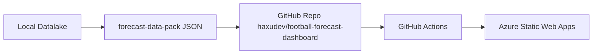

# Azure Deployment Plan — Football Forecast Dashboard

## 1. Status
Validated

## 2. Requirement
Deploy P2 Football Forecast Dashboard to Azure Static Web Apps.

- Requirement ID: `20260508-local-datalake-p2-1-dashboard-deploy`
- Parent: `20260508-local-datalake-p2-football-forecasting`
- User command: “执行 P2.1”

## 3. Azure Context
- Subscription: Visual Studio Enterprise 订阅 (`55a10d87-5de9-4665-a1d3-2af5f71fedfa`)
- Tenant: `138a4eba-6feb-4146-83fd-d8b706ed19f8`
- Resource group: `haxuapps`
- Location: Azure Static Web Apps default/free supported region via CLI selection (`eastasia` preferred if required)

## 4. Recipe
- Type: AZCLI + GitHub Actions
- Service: Azure Static Web Apps
- App type: static Next.js export
- No Azure API backend
- No DB / Python / MLflow in Azure

## 5. Architecture

## 6. Deployment Steps
1. Validate dashboard data and build locally.
2. Create GitHub repo `haxudev/football-forecast-dashboard` if absent.
3. Initialize local git repo, commit dashboard code, push to `main`.
4. Create Azure Static Web App `football-forecast-dashboard` in `haxuapps` and bind to GitHub repo/branch.
5. Ensure workflow app/output paths:
   - `app_location: "/"`
   - `output_location: "out"`
   - `skip_api_build: true`
6. Verify GitHub Actions run or Azure SWA deployment status.
7. Verify public URL returns HTTP 200.

## 7. Validation Proof

Validated at 2026-05-08T20:04:00+08:00.

Commands run:
- `pnpm validate:data`: PASS, 11 files / 3 competitions.
- `pnpm lint`: PASS.
- `pnpm typecheck`: PASS.
- `pnpm test`: PASS, 2 tests.
- `pnpm build`: PASS, 13 static pages generated.
- `gh repo view haxudev/football-forecast-dashboard`: expected absent, confirmed absent.
- `az group show -n haxuapps`: PASS.
- `az staticwebapp show -g haxuapps -n football-forecast-dashboard`: expected absent, confirmed absent.
- Config checked: `next.config.mjs` has `output:'export'`; `staticwebapp.config.json` has `apiRuntime:null`; workflow uses `app_location:"/"`, `output_location:"out"`, `skip_api_build:true`.

Validation result: PASS.

## 8. Security / Boundaries
- Static hosting only.
- No secrets committed.
- No API routes.
- No cloud DB.
- SAMPLE_ONLY baseline language retained.
